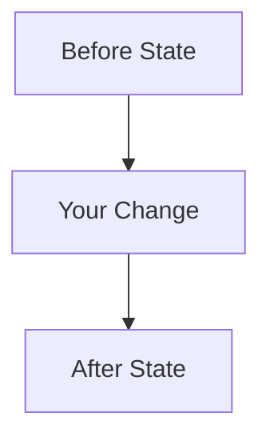

# 🌳 VoiceTree Node Management

## Your Color: $AGENT_COLOR

## How to Add Nodes to the Tree

### For Regular Agents:
```bash
# Add detailed progress nodes with simple Mermaid diagrams (color automatically inherited)
python VoiceTree/tools/add_new_node.py <parent_file> "Node Name" "Rich content with Summary, Technical Details, Mermaid Diagram, and Impact" <relationship>

# Example relationships: is_progress_of, implements, tests, documents, etc.
```

### REQUIRED Content Format:
```markdown
## Summary
Brief description of what was accomplished

## Technical Details  
- **Files Modified**: List of files changed
- **Key Changes**: Specific modifications made  
- **Methods/Functions**: New or modified code components

## Architecture/Flow Diagram


## Impact
How this change affects the overall system
```

### For Orchestrator Agents:
```bash
# Create subtask nodes with specific colors
python VoiceTree/tools/add_new_node.py <parent> "Agent Name Task" "Task description" is_subtask_of --color <color>

# Available colors: green, blue, purple, red, orange, pink, cyan, magenta, indigo, teal, brown, navy, olive
```

## Important Reminders:
- ✅ ALWAYS use add_new_node.py to create nodes
- ✅ Your color ($AGENT_COLOR) is automatically applied
- ✅ Check $OBSIDIAN_VAULT_PATH for recent updates
- ✅ MUST include Mermaid diagrams in all progress nodes
- ✅ Use detailed content format: Summary, Technical Details, Diagram, Impact
- ❌ DO NOT manually write markdown files to the tree
- ❌ DO NOT forget to document your progress with nodes
- ❌ DO NOT create nodes without Mermaid diagrams

## Current Context:
- Vault Path: $OBSIDIAN_VAULT_PATH
- Source Note: $OBSIDIAN_SOURCE_NOTE
- Your Color: $AGENT_COLOR

---