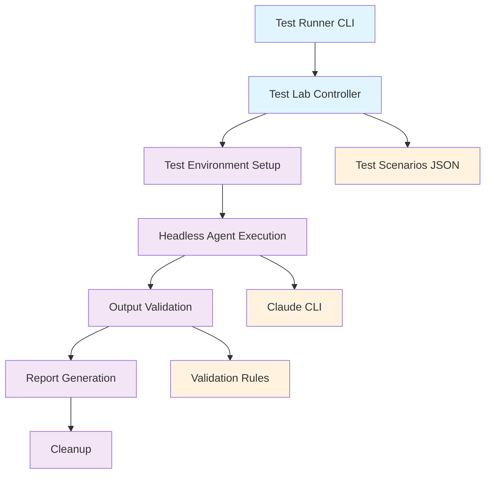
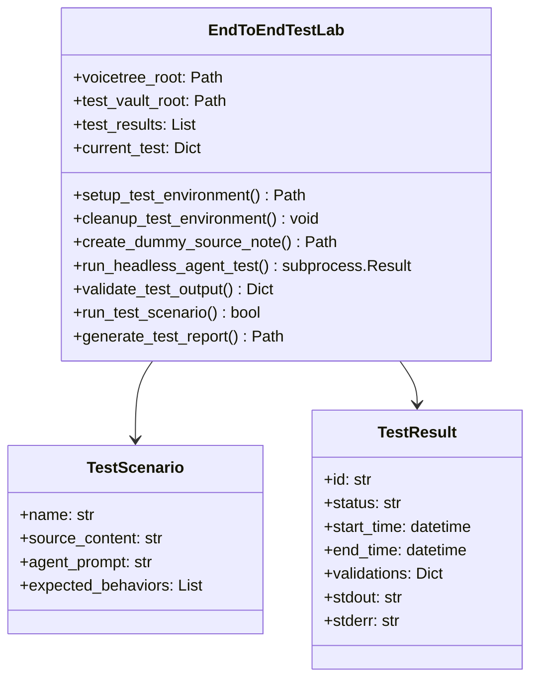
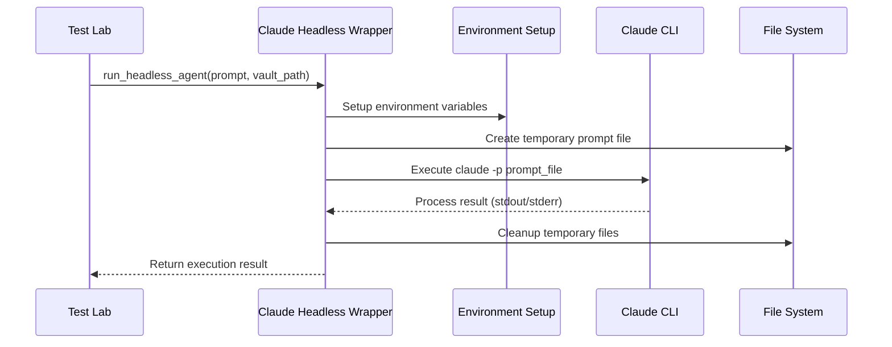
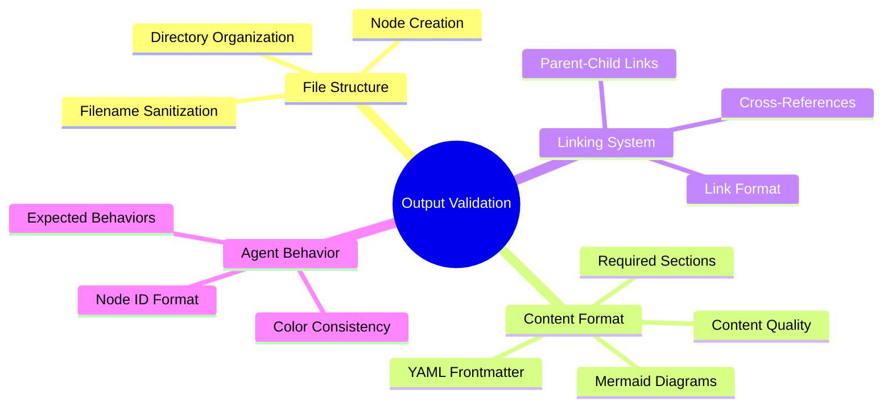
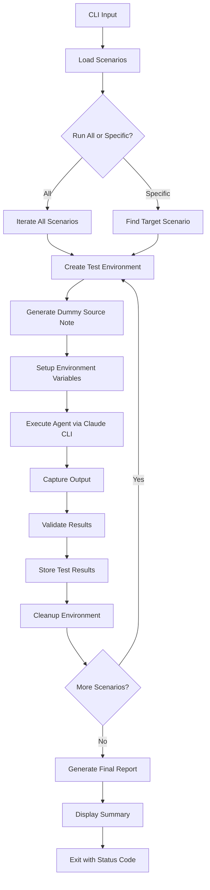
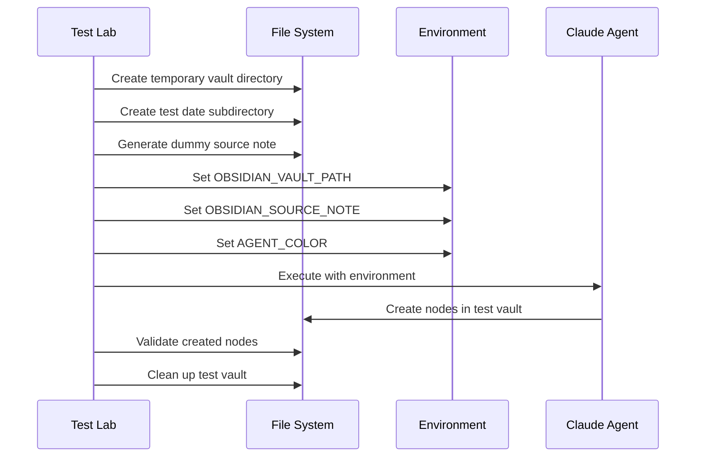
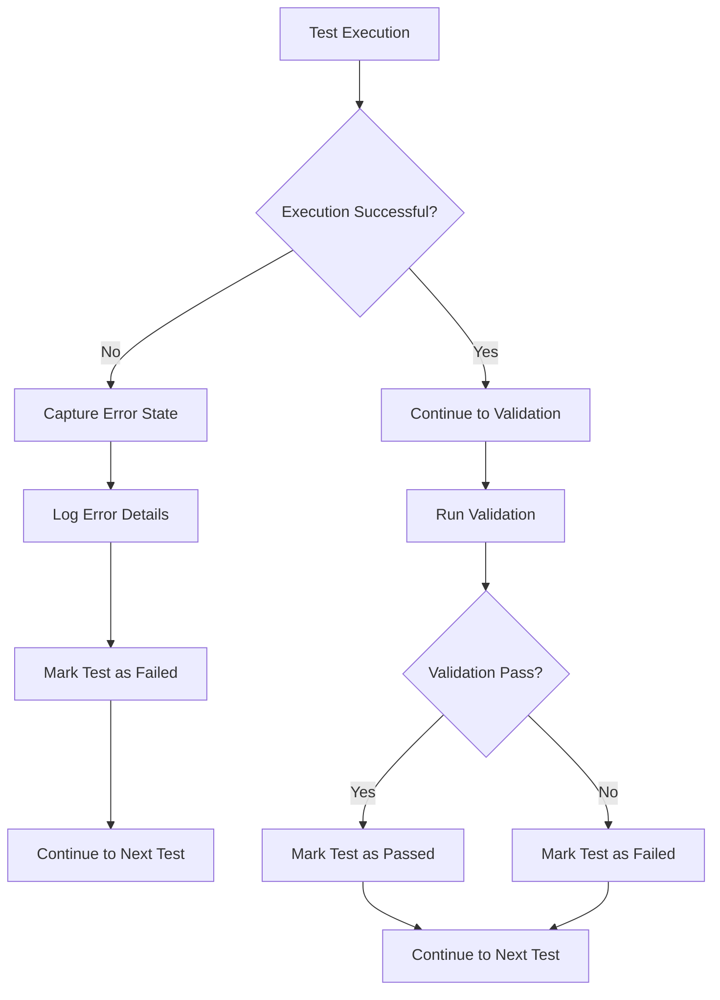

# VoiceTree End-to-End Test Lab Architecture

This document describes the architectural design, components, and data flow of the VoiceTree End-to-End Test Lab system.

## System Overview

The Test Lab is designed to validate agent orchestration in an automated, isolated environment. It simulates the complete agent lifecycle from task initiation through node creation to output validation.



## Core Components

### 1. Test Runner (`run_tests.py`)

**Purpose**: Entry point and CLI interface for the test lab.

**Responsibilities**:
- Parse command-line arguments
- Load test scenarios from JSON configuration
- Orchestrate test execution
- Generate summary reports
- Handle user interaction (list scenarios, run specific tests)

**Key Methods**:
- `load_test_scenarios()`: Load configuration from JSON
- `run_specific_scenario()`: Execute individual test
- `main()`: CLI argument parsing and execution flow

### 2. End-to-End Test Runner (`end_to_end_test_runner.py`)

**Purpose**: Core test execution engine that manages the complete test lifecycle.

**Architecture**:


**Key Responsibilities**:
- **Environment Isolation**: Create temporary test vaults for each scenario
- **Agent Orchestration**: Execute agents using Claude CLI with proper environment setup
- **State Management**: Track test execution state and results
- **Validation Coordination**: Invoke output validators and collect results

### 3. Claude Headless Wrapper (`claude_headless_wrapper.py`)

**Purpose**: Abstraction layer for executing Claude agents in headless mode.

**Architecture**:


**Key Features**:
- **Environment Isolation**: Set up proper environment variables for each test
- **Prompt Management**: Handle temporary prompt files and cleanup
- **Process Management**: Execute Claude CLI with proper timeouts and error handling
- **Context Generation**: Create full agent context including dependency graphs

### 4. Output Validator (`output_validator.py`)

**Purpose**: Comprehensive validation engine for agent output quality and correctness.

**Validation Categories**:



**Validation Pipeline**:
1. **File Discovery**: Find all markdown files created during test
2. **Individual File Validation**: Validate each file against rules
3. **Cross-File Validation**: Check linking and relationships
4. **Behavioral Validation**: Verify expected agent behaviors
5. **Report Generation**: Create detailed validation reports

### 5. Test Configuration (`test_scenarios.json`)

**Purpose**: Declarative configuration for all test scenarios and validation rules.

**Structure**:
```json
{
  "test_scenarios": [
    {
      "name": "Test Name",
      "description": "What this tests",
      "source_content": "Dummy source note content",
      "agent_prompt": "Prompt sent to agent",
      "expected_behaviors": ["behavior1", "behavior2"],
      "validation_criteria": {
        "validation_rule": true
      }
    }
  ],
  "validation_rules": {
    "node_id_pattern": "regex",
    "yaml_required_fields": ["field1", "field2"]
  },
  "test_configuration": {
    "timeout_seconds": 120,
    "pass_threshold": 0.7
  }
}
```

## Data Flow Architecture

### Test Execution Flow



### Environment Setup Process



## Design Patterns and Principles

### 1. Isolation Pattern

**Principle**: Each test runs in complete isolation from others.

**Implementation**:
- Temporary vault creation per test
- Unique test IDs and timestamps
- Environment variable scoping
- Automatic cleanup after each test

### 2. Validation Pipeline Pattern

**Principle**: Comprehensive, extensible validation through multiple stages.

**Stages**:
1. **Structural Validation**: File existence, naming conventions
2. **Content Validation**: YAML frontmatter, required sections
3. **Format Validation**: Mermaid diagrams, link formats
4. **Behavioral Validation**: Expected agent behaviors
5. **Integration Validation**: Cross-node relationships

### 3. Configuration-Driven Testing

**Principle**: Test scenarios defined declaratively rather than programmatically.

**Benefits**:
- Easy addition of new test cases
- Non-developers can create test scenarios
- Version control friendly
- Separation of test logic from test data

### 4. Headless Execution Pattern

**Principle**: Tests run without human intervention or UI dependencies.

**Implementation**:
- Prompt files instead of interactive input
- Subprocess management with timeouts
- Comprehensive result capture
- Error state handling

## Extensibility Points

### Adding New Validation Rules

```python
# In output_validator.py
class AgentOutputValidator:
    def validate_custom_behavior(self, content, criteria):
        # Custom validation logic
        return validation_result
```

### Adding New Test Scenarios

```json
// In test_scenarios.json
{
  "name": "Custom Test",
  "description": "Tests custom behavior",
  "agent_prompt": "Custom prompt",
  "validation_criteria": {
    "custom_rule": true
  }
}
```

### Custom Execution Environments

```python
# Extend EndToEndTestLab
class CustomTestLab(EndToEndTestLab):
    def setup_custom_environment(self):
        # Custom environment setup
        pass
```

## Performance Characteristics

### Execution Time

- **Simple Node Creation**: ~10-30 seconds per test
- **Complex Orchestration**: ~30-90 seconds per test  
- **Full Suite (5 scenarios)**: ~3-8 minutes total

### Resource Usage

- **Memory**: ~50-200MB per test (temporary vault storage)
- **CPU**: Depends on LLM processing time
- **Storage**: Temporary vaults cleaned automatically
- **Network**: LLM API calls for agent execution

### Scalability Considerations

- Tests run sequentially to avoid resource conflicts
- Temporary vaults prevent interference between tests
- JSON configuration allows unlimited test scenarios
- Validation rules can be extended without code changes

## Security Considerations

### Sandbox Isolation

- Each test uses temporary, isolated vault directory
- No access to production vault or data
- Environment variables scoped to test process
- Automatic cleanup prevents data leakage

### Agent Execution Security

- Uses existing Claude CLI security model
- No additional permissions granted for testing
- Test prompts are temporary and cleaned up
- No sensitive data in test scenarios

### Output Validation

- Validates only structural and format requirements
- No execution of generated code
- Safe parsing of YAML frontmatter
- Filename sanitization prevents path traversal

## Error Handling Strategy

### Test Execution Errors



### Recovery Mechanisms

- **Timeout Handling**: Tests timeout after 120 seconds
- **Process Management**: Cleanup on agent process failure
- **File System**: Automatic cleanup even on errors
- **State Recovery**: Test results preserved even on partial failure
- **Graceful Degradation**: Individual test failures don't stop suite

## Integration Points

### VoiceTree System Integration

- Uses existing `add_new_node.py` tool
- Leverages VoiceTree vault structure
- Compatible with existing agent architecture
- Validates against real VoiceTree node formats

### Claude CLI Integration

- Headless execution via `-p` flag
- Uses existing Claude settings and configuration
- Compatible with all Claude CLI features
- Proper environment variable passing

### CI/CD Integration Points

- Exit codes for pass/fail status
- JSON reports for automated parsing  
- CLI flags for different execution modes
- Configurable pass thresholds

## Monitoring and Observability

### Test Execution Tracking

- Real-time progress output
- Individual test timing
- Success/failure rates
- Error categorization

### Performance Monitoring

- Execution time per test
- Validation performance
- Resource usage tracking
- Bottleneck identification

### Quality Metrics

- Pass rate over time
- Validation rule effectiveness
- Test scenario coverage
- Agent behavior consistency

This architecture enables reliable, automated testing of the complete VoiceTree agent orchestration system while maintaining isolation, extensibility, and comprehensive validation capabilities.