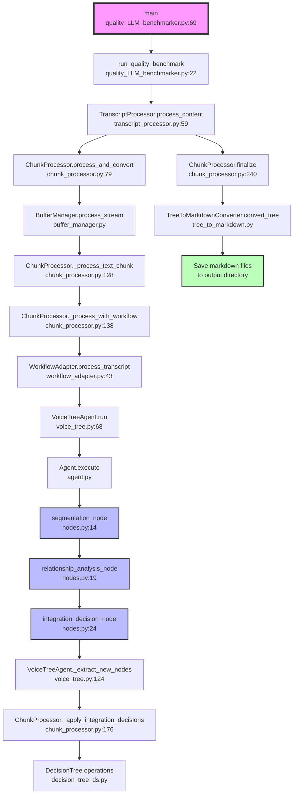

# VoiceTree Call Graph

This diagram shows the main flow of the VoiceTree system from entry point through the processing pipeline.

## Key Components

### Entry Points
- **main()**: Entry point for quality benchmarking system
- **run_quality_benchmark()**: Orchestrates the benchmarking process

### Processing Pipeline
- **TranscriptProcessor**: Manages transcript processing workflow
- **ChunkProcessor**: Core processor that handles text chunks and coordinates components
- **BufferManager**: Manages text buffering and chunk creation
- **WorkflowAdapter**: Bridges between chunk processing and agentic workflow

### Agentic Workflow
- **VoiceTreeAgent**: Implements the LangGraph workflow
- **Nodes**: Three processing nodes in sequence:
  - `segmentation_node`: Segments text into distinct ideas
  - `relationship_analysis_node`: Analyzes relationships between segments
  - `integration_decision_node`: Decides how to integrate into tree structure

### Output Generation
- **DecisionTree**: Maintains the tree structure of ideas
- **TreeToMarkdownConverter**: Converts tree to markdown files
- **Output**: Generated markdown files saved to output directory