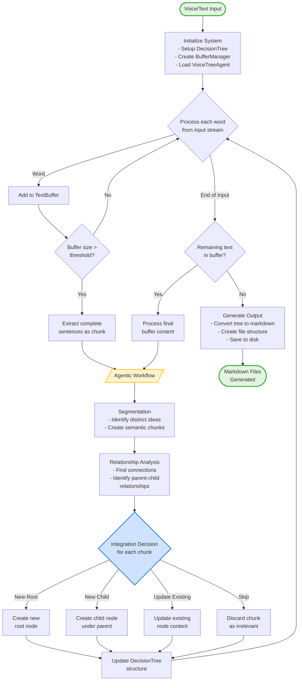

# VoiceTree Control Flow Diagram

This diagram shows the control flow and decision logic of the VoiceTree system.

## Control Flow Explanation

### 1. **Initialization Phase**
- System initializes core components: DecisionTree, BufferManager, and VoiceTreeAgent
- Sets up the processing pipeline

### 2. **Streaming Input Loop**
- Processes input word by word (simulating real-time voice transcription)
- Accumulates words in TextBuffer until threshold is reached
- Extracts complete sentences when buffer is full

### 3. **Agentic Workflow Processing**
The extracted chunks go through three sequential stages:

#### a. **Segmentation**
- Identifies distinct ideas within the chunk
- Breaks down into semantic units
- Prepares chunks for relationship analysis

#### b. **Relationship Analysis**
- Analyzes how chunks relate to existing tree nodes
- Identifies parent-child relationships
- Determines semantic connections

#### c. **Integration Decision**
Makes one of four decisions for each chunk:
- **New Root**: Create a new top-level topic
- **New Child**: Add as child to existing node
- **Update Existing**: Merge with existing node
- **Skip**: Discard as irrelevant/redundant

### 4. **Tree Update**
- Applies integration decisions to DecisionTree
- Maintains hierarchical structure of ideas
- Tracks which nodes need updating

### 5. **Finalization**
- Processes any remaining buffer content
- Converts entire tree to markdown format
- Generates interconnected markdown files
- Saves to output directory

## Key Decision Points

1. **Buffer Threshold Check**: Determines when to process accumulated text
2. **Integration Decision**: Core logic for organizing ideas hierarchically
3. **Final Buffer Check**: Ensures no content is lost at stream end

## Data Flow

- **Input**: Raw text/voice stream
- **Intermediate**: Buffered text → Chunks → Tree nodes
- **Output**: Structured markdown files representing idea hierarchy